# Design Document: Urban Haven Platform (F00–F24)

## Overview

Urban Haven Properties Ltd. is a single-vendor real estate website for a Bangladeshi property company. Company staff publish and manage inventory (Projects, Properties, Units); there is no public seller registration. The platform is built on Laravel 13 / PHP 8.3+, Blade + Tailwind CSS, MySQL 8.4 LTS, Redis, and Nginx/PHP-FPM, with Vite for asset compilation.

The existing repository already provides: a Laravel 13 skeleton, `User`, `Role`, `Permission`, `AuditLog`, `MfaRecoveryCode` models, `MfaService`, `StaffService`, `DatabaseAuditLogger`, `EnsureStaffIsActive` and `EnsureOwnerMfa` middleware, area/money/timezone support helpers, and the roles-permissions-audit_logs migration. All new work builds on top of these foundations.

The 25 features (F00–F24) are executed in strict dependency order. Business rules live in `app/Services` and `app/Policies`; Blade templates contain only presentation logic.

---

## Architecture

### High-Level System Diagram

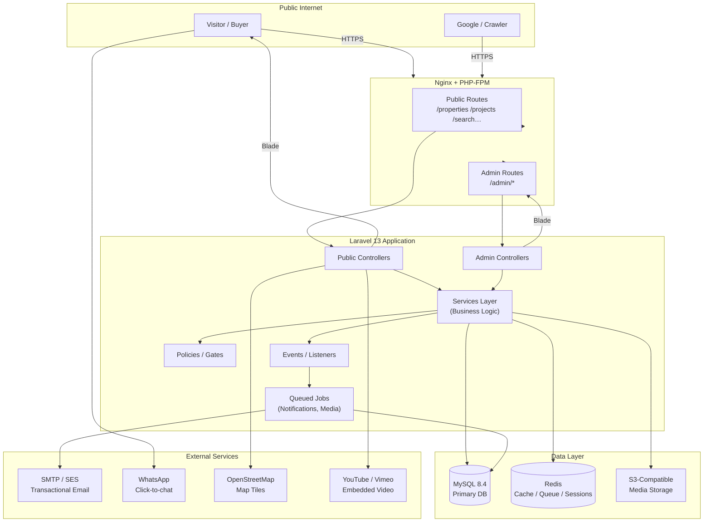

### Request Lifecycle (Admin Write Path)

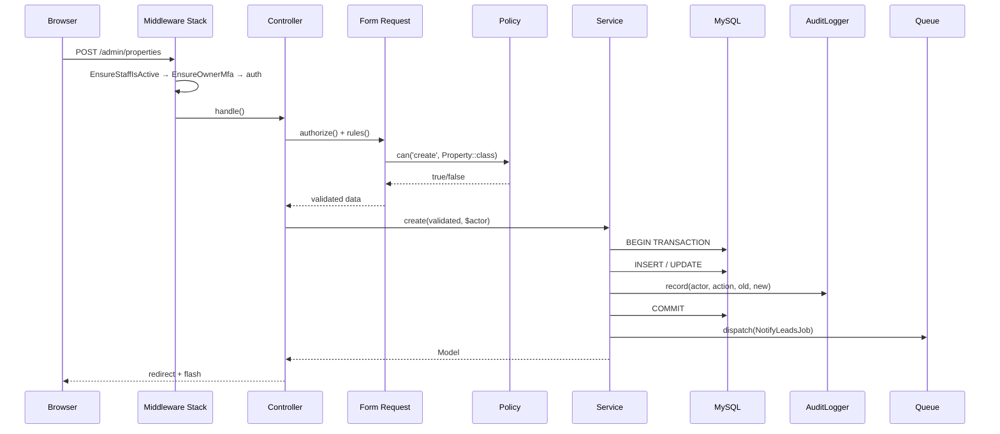

### Public Read Path

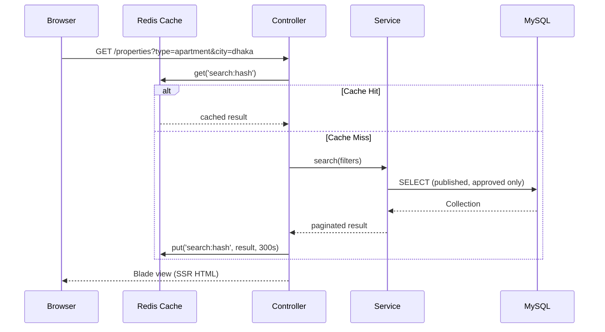

---

## Roles and Permission Model

Three roles are defined in `app/Models/Role.php` constants:

| Role | Key | MFA Required | Scope |
|---|---|---|---|
| Owner Administrator | `owner_admin` | Yes (mandatory) | Full access including settings, staff management, exports |
| Content Editor | `content_editor` | No | Inventory CRUD, media, CMS pages |
| Sales User | `sales_user` | No | Leads, site visits, sales workflow |

Permission keys follow the `resource.action` convention (e.g. `property.create`, `lead.export`). The `owner_admin` role implicitly passes all permission checks via the `before()` gate hook.

---

## Data Models

### F02 — Settings & Reference Data

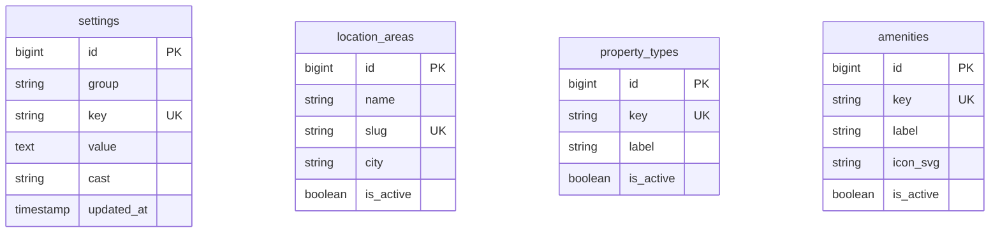

### F03 — Media

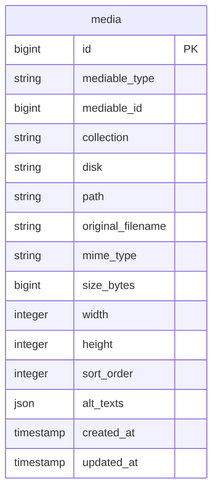

### F04 — Inventory (Projects, Properties, Units)

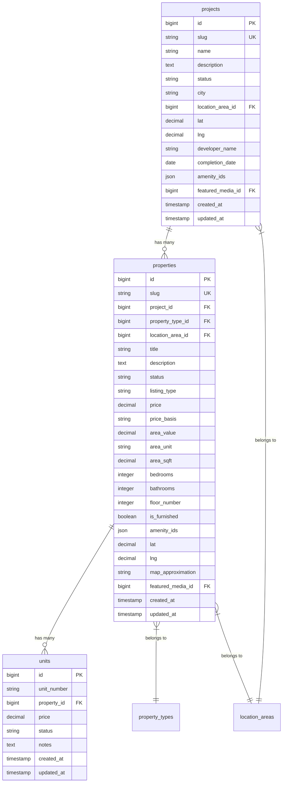

### F05 — Publication & Editorial Workflow

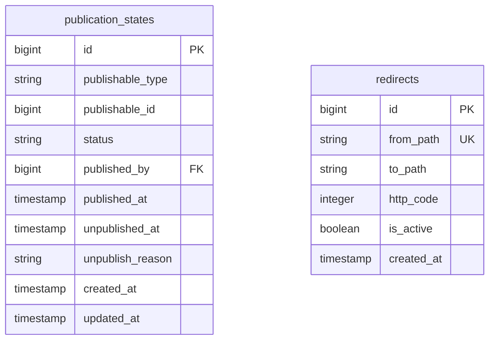

Publication `status` values: `draft` → `pending_review` → `approved` → `published` → `unpublished`.

### F13 — Leads

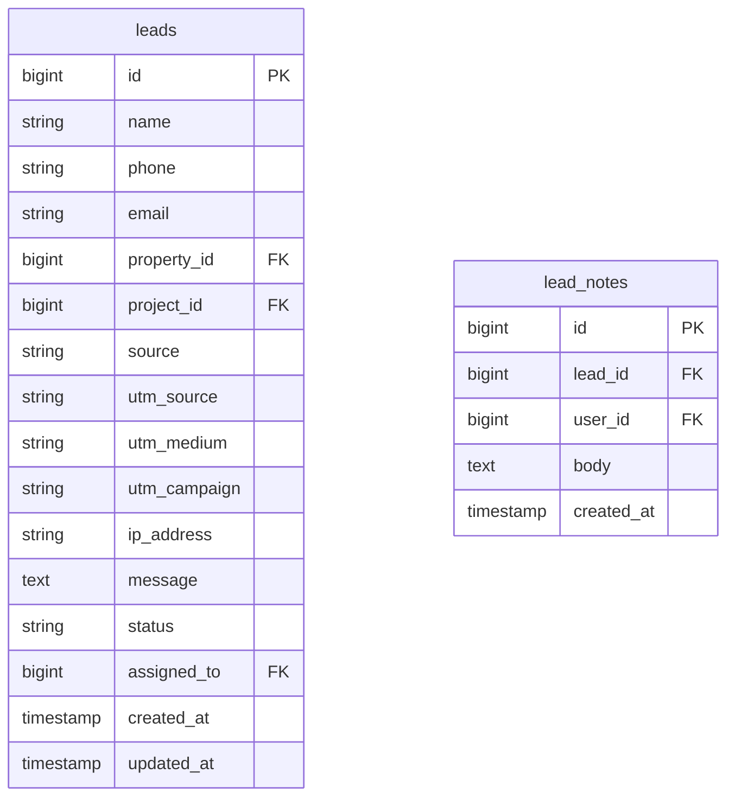

### F14 — Site Visits

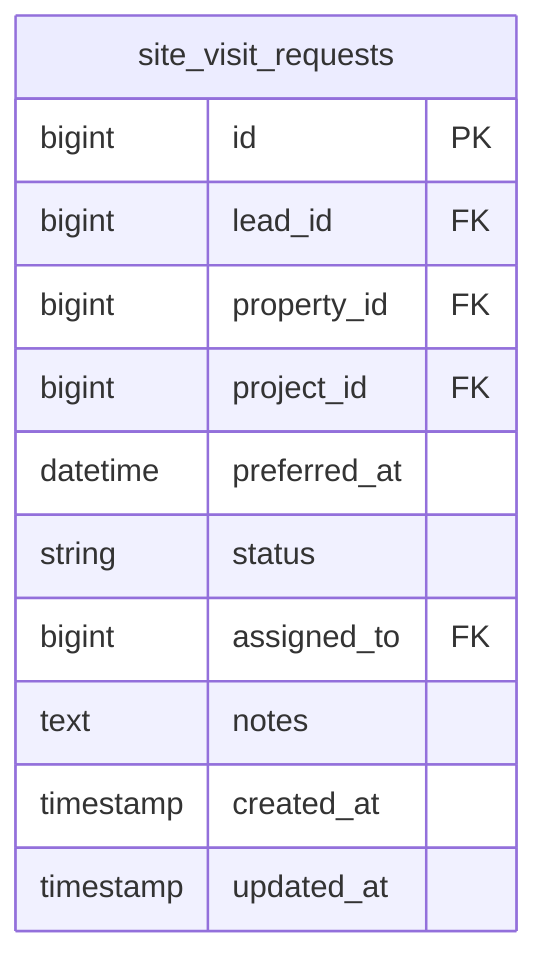

### F15 — Sales Workflow

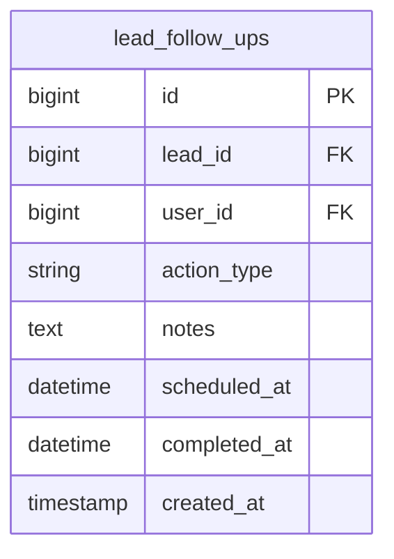

`lead_follow_ups.action_type` values: `call`, `email`, `whatsapp`, `meeting`, `note`.

### F16 — Notifications

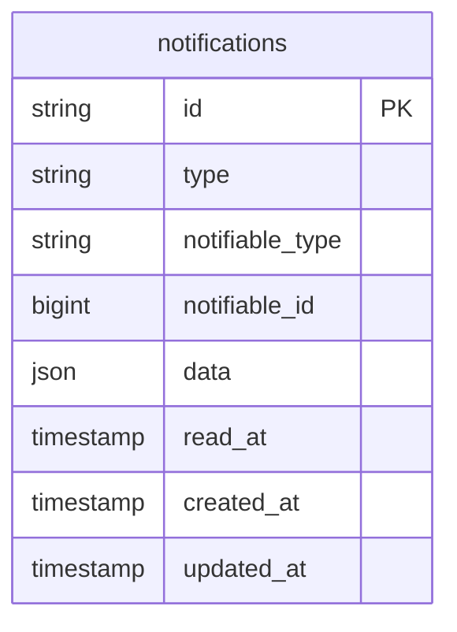

Uses Laravel's built-in polymorphic notifications table.

### F19 — CMS Pages

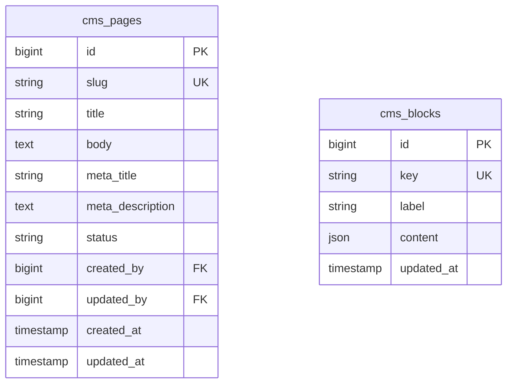

### F21 — SEO

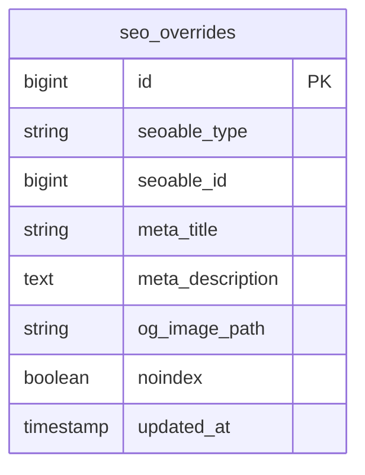

---

## Components and Interfaces

### Service Layer Contracts

All services are resolved via the service container. Business-critical services:

```php
// app/Contracts/InventoryService.php
interface InventoryService
{
    public function createProperty(array $validated, User $actor): Property;
    public function updateProperty(Property $property, array $validated, User $actor): Property;
    public function deleteProperty(Property $property, User $actor): void;
    public function publishProperty(Property $property, User $actor): void;
    public function unpublishProperty(Property $property, string $reason, User $actor): void;
}

// app/Contracts/LeadService.php
interface LeadService
{
    public function capture(array $validated, Request $request): Lead;
    public function assign(Lead $lead, User $assignee, User $actor): void;
    public function addNote(Lead $lead, string $body, User $actor): LeadNote;
    public function scheduleFollowUp(Lead $lead, array $data, User $actor): LeadFollowUp;
}

// app/Contracts/SearchService.php
interface SearchService
{
    public function search(array $filters, int $page, int $perPage): LengthAwarePaginator;
    public function similar(Property $property, int $limit): Collection;
}

// app/Contracts/MediaService.php
interface MediaService
{
    public function store(Model $owner, UploadedFile $file, string $collection): Media;
    public function reorder(Model $owner, string $collection, array $orderedIds): void;
    public function delete(Media $media, User $actor): void;
}
```

### Policy Map

```php
// Policies registered in AppServiceProvider::boot()
Gate::policy(Property::class,  PropertyPolicy::class);   // view, create, update, delete, publish
Gate::policy(Project::class,   ProjectPolicy::class);    // view, create, update, delete, publish
Gate::policy(Lead::class,      LeadPolicy::class);       // view, assign, export
Gate::policy(CmsPage::class,   CmsPagePolicy::class);    // view, create, update, delete
Gate::policy(User::class,      StaffPolicy::class);      // view, create, update, deactivate
```

---

## Algorithmic Pseudocode

### F04/F05 — Property Publication Workflow

```pascal
PROCEDURE publishProperty(property, actor)
  INPUT: property (Property model), actor (User)
  OUTPUT: void

  PRECONDITION: property.status = 'approved'
  PRECONDITION: actor.hasPermission('property.publish') OR actor.isOwnerAdmin()

  BEGIN
    DB.transaction(() =>
      state ← PublicationState.firstOrCreate({ publishable: property })
      state.update({
        status: 'published',
        published_by: actor.id,
        published_at: now(),
        unpublished_at: null
      })
      AuditLogger.record(actor.id, 'property.published', Property, property.id,
                         { status: old_status }, { status: 'published' })
    )
    Cache.tags(['properties', 'property:' + property.id]).flush()
  END

PROCEDURE unpublishProperty(property, reason, actor)
  INPUT: property (Property model), reason (String), actor (User)
  OUTPUT: void

  PRECONDITION: property.publicationState.status = 'published'
  PRECONDITION: reason IS NOT EMPTY

  BEGIN
    DB.transaction(() =>
      state ← property.publicationState
      state.update({
        status: 'unpublished',
        unpublished_at: now(),
        unpublish_reason: reason
      })
      AuditLogger.record(actor.id, 'property.unpublished', Property, property.id, ...)
    )
    Cache.tags(['properties', 'property:' + property.id]).flush()
    Redirect.createIfSlugChanged(property)
  END
```

### F07 — Property Search Algorithm

```pascal
ALGORITHM searchProperties(filters, page, perPage)
  INPUT:  filters { type, city, area_id, min_price, max_price,
                    min_beds, max_beds, listing_type, amenities[] }
          page: integer >= 1
          perPage: integer in [1, 24]
  OUTPUT: LengthAwarePaginator

  PRECONDITION: All exposed records have publication_state.status = 'published'

  BEGIN
    cacheKey ← 'search:' + md5(serialize(filters) + page + perPage)

    IF Cache.has(cacheKey) THEN
      RETURN Cache.get(cacheKey)
    END IF

    query ← Property.query()
                    .published()        // scope: joins publication_states WHERE status='published'
                    .with(['featuredMedia', 'locationArea', 'propertyType'])

    IF filters.type IS NOT NULL THEN
      query.whereHas('propertyType', fn => where('key', filters.type))
    END IF
    IF filters.city IS NOT NULL THEN
      query.whereHas('locationArea', fn => where('city', filters.city))
    END IF
    IF filters.area_id IS NOT NULL THEN
      query.where('location_area_id', filters.area_id)
    END IF
    IF filters.min_price IS NOT NULL THEN
      query.where('price', '>=', filters.min_price)
    END IF
    IF filters.max_price IS NOT NULL THEN
      query.where('price', '<=', filters.max_price)
    END IF
    IF filters.min_beds IS NOT NULL THEN
      query.where('bedrooms', '>=', filters.min_beds)
    END IF
    IF filters.listing_type IS NOT NULL THEN
      query.where('listing_type', filters.listing_type)
    END IF
    IF filters.amenities IS NOT EMPTY THEN
      FOR each amenity_id IN filters.amenities DO
        query.whereJsonContains('amenity_ids', amenity_id)
      END FOR
    END IF

    result ← query.orderByDesc('published_at').paginate(perPage, ['*'], 'page', page)

    Cache.put(cacheKey, result, seconds: 300)
    RETURN result
  END
```

### F12 — Similar Properties Algorithm

```pascal
ALGORITHM similarProperties(property, limit)
  INPUT:  property (Property model), limit (integer, default 6)
  OUTPUT: Collection<Property>

  PRECONDITION: property.publication_state.status = 'published'

  BEGIN
    priceLow  ← property.price * (1 - PRICE_BAND_PERCENT / 100)
    priceHigh ← property.price * (1 + PRICE_BAND_PERCENT / 100)

    // Priority tier 1: same area, same type, price within band
    tier1 ← Property.published()
                     .where('id', '!=', property.id)
                     .where('location_area_id', property.location_area_id)
                     .where('property_type_id', property.property_type_id)
                     .whereBetween('price', [priceLow, priceHigh])
                     .with(['featuredMedia'])
                     .limit(limit)
                     .get()

    IF tier1.count() >= limit THEN RETURN tier1 END IF

    // Priority tier 2: same city, same type
    needed ← limit - tier1.count()
    exclude ← tier1.pluck('id').push(property.id)
    tier2 ← Property.published()
                     .whereNotIn('id', exclude)
                     .whereHas('locationArea', fn => where('city', property.locationArea.city))
                     .where('property_type_id', property.property_type_id)
                     .with(['featuredMedia'])
                     .limit(needed)
                     .get()

    RETURN tier1.merge(tier2)
  END
```

### F13 — Lead Capture (Transactional)

```pascal
PROCEDURE captureLead(validated, request)
  INPUT:  validated { name, phone, email?, message?, property_id?, project_id?, source }
          request (HTTP Request — for UTM params, IP)
  OUTPUT: Lead

  POSTCONDITION: lead IS persisted before any notification is dispatched
  POSTCONDITION: notification dispatch failure DOES NOT prevent lead persistence

  BEGIN
    phone_hash ← hash(validated.phone)
    window_start ← now() - repeat_window_days * 86400

    // Idempotency: suppress duplicates within repeat window
    existing ← Lead.where('phone_hash', phone_hash)
                   .where('property_id', validated.property_id)
                   .where('created_at', '>=', window_start)
                   .first()

    IF existing IS NOT NULL THEN
      RETURN existing   // silently return; do not re-notify
    END IF

    lead ← DB.transaction(() =>
      Lead.create({
        name:          validated.name,
        phone:         validated.phone,
        email:         validated.email,
        property_id:   validated.property_id,
        project_id:    validated.project_id,
        source:        validated.source,
        utm_source:    request.query('utm_source'),
        utm_medium:    request.query('utm_medium'),
        utm_campaign:  request.query('utm_campaign'),
        ip_address:    request.ip(),
        message:       validated.message,
        status:        'new',
      })
    )

    // Fire-and-forget — async queue, never blocks HTTP response
    dispatch(NotifyNewLeadJob(lead.id))
    dispatch(AttributeLeadSourceJob(lead.id))

    RETURN lead
  END
```

### F16 — Notification Dispatch

```pascal
PROCEDURE NotifyNewLeadJob.handle(lead_id)
  INPUT: lead_id (integer)
  OUTPUT: void

  BEGIN
    lead ← Lead.with(['property', 'project']).findOrFail(lead_id)

    // Notify assigned sales user (or all sales users if unassigned)
    recipients ← IF lead.assigned_to IS NOT NULL
                 THEN [User.find(lead.assigned_to)]
                 ELSE User.role('sales_user').get()

    FOR each recipient IN recipients DO
      recipient.notify(new NewLeadNotification(lead))
    END FOR

    // Database notification for in-app bell
    // Mail notification via queued Mailable
  END
```

### F21 — Sitemap Generation

```pascal
PROCEDURE generateSitemap()
  OUTPUT: XML string

  BEGIN
    urls ← []

    // Static pages
    urls.add({ loc: '/', changefreq: 'daily', priority: 1.0 })
    urls.add({ loc: '/properties', changefreq: 'hourly', priority: 0.9 })
    urls.add({ loc: '/projects', changefreq: 'daily', priority: 0.8 })

    // Published properties
    FOR each property IN Property.published().select(['slug', 'updated_at']) DO
      urls.add({ loc: '/properties/' + property.slug,
                 lastmod: property.updated_at,
                 changefreq: 'weekly',
                 priority: 0.7 })
    END FOR

    // Published projects
    FOR each project IN Project.published().select(['slug', 'updated_at']) DO
      urls.add({ loc: '/projects/' + project.slug,
                 lastmod: project.updated_at,
                 changefreq: 'weekly',
                 priority: 0.7 })
    END FOR

    // CMS pages
    FOR each page IN CmsPage.published().select(['slug', 'updated_at']) DO
      urls.add({ loc: '/' + page.slug,
                 lastmod: page.updated_at,
                 changefreq: 'monthly',
                 priority: 0.5 })
    END FOR

    RETURN buildSitemapXml(urls)
  END
```

---

## Key Functions with Formal Specifications

### `AreaConverter::toSqft(value, unit)`

**Already implemented** in `app/Support/AreaConverter.php`.

**Preconditions:**
- `value` is a finite positive numeric value
- `unit` key exists in `config('urbanhaven.area_units')`

**Postconditions:**
- Returns a positive float rounded to 4 decimal places
- `toSqft(1, 'sqft') === 1.0`
- `toSqft(1, 'katha') === 720.0`

### `MoneyFormatter::formatBdt(amount, basis)`

**Already implemented** in `app/Support/MoneyFormatter.php`.

**Preconditions:**
- `amount` is null, empty string, or a finite numeric value

**Postconditions:**
- `null` / empty → `'Price on request'`
- `basis === 'monthly_rent'` → suffix `/month` is appended
- Always prefixed with `BDT `

### `PropertyPolicy::publish(user, property)`

```php
function publish(User $user, Property $property): bool
```

**Preconditions:**
- `user` is authenticated and `is_active === true`
- `property` exists

**Postconditions:**
- Returns `true` if `user.isOwnerAdmin()` OR `user.hasPermission('property.publish')`
- Returns `false` otherwise
- No side effects

### `LeadService::capture(validated, request)`

**Preconditions:**
- `validated.phone` is non-empty, validated BD phone format
- At least one of `property_id` or `project_id` or `source` is present

**Postconditions:**
- Lead is persisted in DB before method returns
- If duplicate within repeat window: returns existing lead, no new record
- Notification jobs are dispatched asynchronously (failure-isolated)
- No side effects on HTTP session

### `SearchService::search(filters, page, perPage)`

**Preconditions:**
- `perPage` ∈ [1, 24]
- `page` ≥ 1
- All filter values are of expected types (validated by Form Request)

**Postconditions:**
- Only records with `publication_state.status = 'published'` are returned
- Result is cached for 300 seconds unless cache is disabled
- Pagination metadata (`total`, `per_page`, `current_page`) is always present

---

## Media Handling (F03)

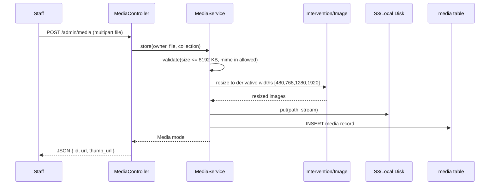

Derivatives are stored at `{disk}/media/{id}/{width}.webp`. The original is preserved at `{disk}/media/{id}/original.{ext}`. The `alt_texts` JSON field stores `{ en: "...", bn: "..." }` for bilingual alt attributes.

---

## Public-Facing Routes & Caching Strategy

| Route | Cache TTL | Cache Tags | Invalidated On |
|---|---|---|---|
| `/properties` (listing) | 5 min | `properties` | Any property publish/unpublish |
| `/properties/{slug}` (detail) | 10 min | `property:{id}` | Property updated/unpublished |
| `/projects` (listing) | 5 min | `projects` | Any project publish/unpublish |
| `/projects/{slug}` (detail) | 10 min | `project:{id}` | Project updated |
| `/sitemap.xml` | 1 hour | `sitemap` | Any publish/unpublish event |
| `/search` (AJAX filters) | 5 min | `properties` | Property inventory changes |

Cache invalidation is triggered by service-layer events, never from controllers. All public queries apply the `published()` scope — no draft or pending records ever reach the response.

---

## Error Handling

### Lead Capture Failure
- **Condition**: DB insert fails (constraint violation, timeout)
- **Response**: 500 with JSON `{ error: "We could not save your enquiry. Please try again." }`; error logged to `laravel.log` with context
- **Recovery**: Retry via queued job is not applicable here (lead save is synchronous). Client-side retry button shown.

### Media Upload Failure
- **Condition**: File too large, wrong MIME, S3 unavailable
- **Response**: Validation error 422 with specific message; partial uploads are rolled back; no orphaned media records
- **Recovery**: Staff retries upload

### Property Slug Collision on Update
- **Condition**: Edited slug already exists for another property
- **Response**: Validation error on slug field; old slug preserved; redirect row created automatically only on successful slug change
- **Recovery**: Staff chooses a unique slug

### Queue Worker Down
- **Condition**: Redis queue worker offline; notification jobs not processed
- **Response**: Jobs accumulate in queue, retried up to 3 times with exponential backoff. Lead is already saved so no data loss.
- **Recovery**: Worker restart drains queue; `QUEUE_FALLBACK_CONNECTION=database` ensures persistence

### Unauthorized Admin Access
- **Condition**: `sales_user` attempts to access `owner_admin` route
- **Response**: 403 Forbidden from `authorize()` in Form Request or `$this->authorize()` in Controller
- **Recovery**: Redirect to admin dashboard with error flash

---

## Testing Strategy

### Unit Testing Approach

Tests live in `tests/Unit/`. Each service is tested in isolation with mocked dependencies (DB, AuditLogger, Queue). PHPUnit 12 is the test runner.

Key unit test targets:
- `AreaConverter` — all area unit conversions, invalid unit throws
- `MoneyFormatter` — null/empty/numeric/infinite inputs
- `MfaService` — secret generation, TOTP verify, recovery code issue/consume
- `LeadService` — duplicate suppression logic, UTM attribution
- `SearchService` — filter application, cache key generation
- `SimilarPropertiesService` — tier fallback logic

### Property-Based Testing Approach

**Property Test Library**: PHPUnit with data providers (or optionally `eris/eris` if added)

Key properties:
- `AreaConverter::toSqft(v, u) > 0` for all positive `v` and valid `u`
- `MoneyFormatter::formatBdt(n)` always starts with `'BDT '` or equals `'Price on request'` for any finite `n`
- `SearchService::search(filters)` never returns unpublished records regardless of filter combination
- `LeadService::capture()` called twice with same phone+property within window returns same lead ID (idempotency)

### Feature/Integration Testing Approach

Tests live in `tests/Feature/`. Use `RefreshDatabase` trait + SQLite in-memory for speed.

Key feature test targets per feature:
- **F01**: Login flow, MFA challenge, failed login audit, deactivation logout
- **F04**: Property CRUD with role assertions (403 for wrong role)
- **F05**: Publish/unpublish state transitions, invalid transition rejected
- **F07**: Search returns only published, filters reduce result set correctly
- **F13**: Lead capture persists before queue dispatch; duplicate suppressed
- **F14**: Site visit request creates and notifies
- **F15**: Follow-up scheduling and completion
- **F18**: CSV export returns correct columns, respects date range filter
- **F21**: Sitemap XML valid, contains published slugs only
- **F23**: CSRF on all POST forms, XSS in output escaped, SQL injection via parameterised queries

---

## Security Considerations

- **Authentication**: All `/admin/*` routes behind `auth` + `EnsureStaffIsActive` + `EnsureOwnerMfa` middleware stack
- **Authorization**: Every controller action calls `$this->authorize()` or uses a Form Request with `authorize()`; `owner_admin` `before()` gate hook grants full access
- **MFA**: TOTP (Google Authenticator compatible) mandatory for `owner_admin`; 8 one-time recovery codes, single-use, hashed at rest
- **CSRF**: Laravel CSRF middleware on all state-changing requests; verified tokens on all Blade forms
- **XSS**: Blade `{{ }}` escaping enforced; `{!! !!}` used only for pre-sanitised CMS HTML (purified via HTMLPurifier or equivalent)
- **SQL Injection**: All queries via Eloquent ORM or parameterised query builder; no raw string interpolation in queries
- **Media**: MIME type validated server-side; images processed through Intervention/Image (strips EXIF, validates dimensions); no executable file types allowed
- **Rate Limiting**: Throttle middleware on `/admin/login` (5 attempts / minute) and lead capture endpoints (10 / minute per IP)
- **Secrets**: `mfa_secret` encrypted at rest via Laravel's `encrypted` cast; no secrets in logs
- **Audit Trail**: Every staff write action recorded in `audit_logs` with actor, IP, old/new values
- **Session Security**: Database-backed sessions; `EnsureStaffIsActive` logs out deactivated users on next request; deactivation purges all sessions from `sessions` table
- **Approximate Map Coords**: Public map markers rounded to `approximate_decimals: 2` (≈1 km precision) to avoid exposing exact unit coordinates

---

## Performance Considerations

- **No premature optimisation**: No Elasticsearch or microservices until measured bottlenecks justify it
- **Query caching**: Redis tag-based caching on all public listing/detail routes (see cache strategy table above)
- **Eager loading**: All controllers use `->with([...])` to avoid N+1; `barryvdh/laravel-debugbar` used in local env
- **Media derivatives**: Pre-generated at upload time; `srcset` served from storage; no on-the-fly resizing in production
- **Pagination**: 12 per page default, max 24; cursor pagination considered for large datasets in future
- **Queue**: Notifications and media processing are async; lead save is always synchronous and fast (no blocking I/O)
- **Database**: Composite indexes on `(location_area_id, property_type_id, price)`, `(status, published_at)` on `properties`; `(phone_hash, property_id, created_at)` on `leads` for duplicate suppression

---

## Feature Dependency Map

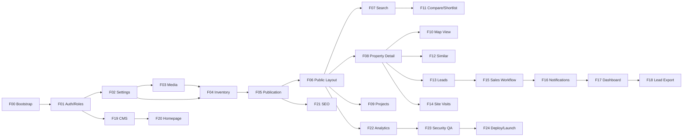

---

## Dependencies

### PHP / Composer (already in composer.json)

| Package | Purpose |
|---|---|
| `laravel/framework ^13.17` | Core framework |
| `pragmarx/google2fa ^9.0` | TOTP MFA |
| `bacon/bacon-qr-code ^3.0` | QR code SVG for MFA enroll |
| `intervention/image ^3.0` | Image processing / derivatives |
| `predis/predis ^3.0` | Redis client |

### Packages to Add During Build

| Package | Feature | Purpose |
|---|---|---|
| `spatie/laravel-sluggable` | F04 | Auto-slug generation for properties/projects |
| `spatie/laravel-medialibrary` | F03 | (alternative) — or custom Media model per design |
| `league/csv` | F18 | CSV export for leads |
| `ezyang/htmlpurifier` or `stevebauman/purify` | F19 | CMS HTML sanitisation |
| `laravel/telescope` | F23 | Dev/staging request inspection |

### Front-end

| Library | Purpose |
|---|---|
| Tailwind CSS (via npm) | Utility-first CSS |
| Alpine.js | Lightweight JS interactivity (dropdowns, toggles, compare) |
| Leaflet.js | Map view (F10) — uses OSM tiles |
| Vite | Asset bundler |

### Infrastructure

| Component | Version / Notes |
|---|---|
| MySQL | 8.4 LTS |
| Redis | 7+ (cache, queue, sessions) |
| Nginx | PHP-FPM upstream |
| PHP | 8.3+ |
| S3-compatible storage | Media files (AWS S3 or local MinIO) |


---

## Correctness Properties

*A property is a characteristic or behavior that should hold true across all valid executions of a system — essentially, a formal statement about what the system should do. Properties serve as the bridge between human-readable specifications and machine-verifiable correctness guarantees.*

### Property 1: MFA Session Enforcement

*For any* authenticated owner_admin user who has not completed TOTP verification in the current session, every request to any `/admin/*` route must result in a redirect to the MFA challenge page.

**Validates: Requirement 2.3**

### Property 2: Recovery Code Single-Use

*For any* unused recovery code issued to an owner_admin user, consuming it once must mark it as used; a subsequent attempt to use the same code must fail and not grant MFA-verified access.

**Validates: Requirement 2.5**

### Property 3: Deactivated Staff Lockout

*For any* deactivated staff user, any request to any `/admin/*` route must result in session invalidation and redirect to the login page.

**Validates: Requirement 2.6**

### Property 4: Owner Admin Gate Bypass

*For any* permission key and any user with the `owner_admin` role, `User::hasPermission()` must return `true` via the `before()` gate hook.

**Validates: Requirement 2.8**

### Property 5: Settings Round-Trip

*For any* valid setting `key`, `value`, and `cast` type, writing a setting then reading it back must return the correctly typed value (e.g., integer cast returns an integer, boolean cast returns a boolean).

**Validates: Requirement 3.2**

### Property 6: Inactive Reference Data Exclusion

*For any* reference data item (location_area, property_type, or amenity) with `is_active = false`, the item must not appear in any admin option list for inventory creation or editing.

**Validates: Requirement 3.4**

### Property 7: Media Derivative Generation

*For any* valid uploaded image, after processing by the MediaService, derivative files must exist at widths 480, 768, 1280, and 1920 pixels in WebP format.

**Validates: Requirement 4.2**

### Property 8: Invalid Upload Rejection

*For any* uploaded file that either exceeds 8192 KB or has a disallowed MIME type, the MediaService must return a 422 error and no media record or file must be created.

**Validates: Requirements 4.1, 4.3**

### Property 9: Media Reorder Consistency

*For any* ordered array of media IDs submitted to the reorder endpoint, after the operation each media item's `sort_order` must equal its position in the submitted array.

**Validates: Requirement 4.6**

### Property 10: Area Conversion Correctness

*For any* positive finite `area_value` and valid `area_unit` key, the `area_sqft` stored on the property must equal `AreaConverter::toSqft(area_value, area_unit)` rounded to 4 decimal places, and must be positive.

**Validates: Requirement 5.2**

### Property 11: Slug Uniqueness

*For any* two distinct Properties or Projects, their slugs must differ even when their names are identical (enforced by numeric suffix appending).

**Validates: Requirements 5.3, 5.4**

### Property 12: Publication State Machine Validity

*For any* publishable item and any requested state transition that does not follow the allowed sequence (`draft` → `pending_review` → `approved` → `published` → `unpublished`), the Publication_System must reject the transition and preserve the current status.

**Validates: Requirement 6.7**

### Property 13: Cache Flush on Publish/Unpublish

*For any* Property or Project that transitions to `published` or `unpublished`, all associated Redis cache tags must be flushed so that subsequent reads reflect the new state.

**Validates: Requirement 6.8**

### Property 14: Search Returns Only Published Records

*For any* combination of search filters, the SearchService must return only Properties whose `publication_states.status` equals `published`; no draft, pending, approved, or unpublished record must appear in results.

**Validates: Requirement 8.1**

### Property 15: Search Filter Monotonicity

*For any* search query, adding one or more additional filters must not increase the total result count (adding constraints can only reduce or preserve the set).

**Validates: Requirement 8.3**

### Property 16: Unpublished Property Returns 404

*For any* property slug where the corresponding property is not in `published` state and no redirect record exists, a GET request to `/properties/{slug}` must return HTTP 404.

**Validates: Requirement 9.3**

### Property 17: Money Formatting Invariant

*For any* finite numeric price value, `MoneyFormatter::formatBdt()` must return a string that begins with `BDT `; for a null or empty price, it must return exactly `Price on request`.

**Validates: Requirement 9.4**

### Property 18: Map Coordinate Approximation

*For any* published property with exact latitude/longitude coordinates, the coordinates exposed to the Map_Component must be rounded to at most 2 decimal places.

**Validates: Requirement 11.1**

### Property 19: Similar Properties Invariants

*For any* published source property, the SimilarPropertiesService must return at most 6 results, all of which have `publication_states.status = published`, and none of which has the same `id` as the source property.

**Validates: Requirements 13.1, 13.4, 13.5**

### Property 20: Lead Capture Idempotency

*For any* enquiry submitted twice with the same phone number and property_id within the configured repeat window, only one lead record must exist in the database and no second notification job must be dispatched.

**Validates: Requirement 14.2**

### Property 21: Lead UTM Attribution Round-Trip

*For any* HTTP request to the lead capture endpoint that includes `utm_source`, `utm_medium`, and `utm_campaign` query parameters, the persisted lead record must contain the same UTM values.

**Validates: Requirement 14.3**

### Property 22: Follow-Up Action Type Constraint

*For any* follow-up record created by the LeadService, the `action_type` field must be one of the five permitted values: `call`, `email`, `whatsapp`, `meeting`, `note`.

**Validates: Requirement 16.2**

### Property 23: Lead Export Date Range Completeness

*For any* export request with a specified date range, every lead with `created_at` within the range (inclusive) must appear in the CSV, and no lead outside the range must appear.

**Validates: Requirement 19.1**

### Property 24: CMS HTML Sanitization

*For any* HTML string submitted as CMS page body that contains tags or attributes not in the purifier's allowlist, the stored body must not contain those disallowed elements.

**Validates: Requirement 20.2**

### Property 25: Sitemap Contains Only Published Slugs

*For any* generated sitemap XML, every `<loc>` URL must correspond to a currently published Property, Project, or CMS page (or one of the three static routes); no unpublished item's slug must appear.

**Validates: Requirement 22.3**

### Property 26: SEO Override Priority

*For any* public page that has a `seo_overrides` record, the rendered `<meta name="title">` and `<meta name="description">` tags must use the override values, not the model defaults.

**Validates: Requirement 22.1**

### Property 27: Analytics Script Conditional Rendering

*For any* public page response, the analytics script tag must be present in the rendered HTML if and only if the `analytics_script` setting contains a non-empty value.

**Validates: Requirement 23.1**

### Property 28: CSRF Protection on State-Changing Requests

*For any* POST, PUT, PATCH, or DELETE request that omits a valid CSRF token, the System must return HTTP 419 and must not execute the intended action.

**Validates: Requirement 24.1**

### Property 29: Rate Limit on Login

*For any* sequence of more than 5 login attempts from the same IP address within a 60-second window, the sixth and subsequent attempts must receive HTTP 429.

**Validates: Requirement 2.10**

### Property 30: Rate Limit on Lead Capture

*For any* sequence of more than 10 lead capture requests from the same IP address within a 60-second window, the eleventh and subsequent requests must receive HTTP 429.

**Validates: Requirement 14.6**
